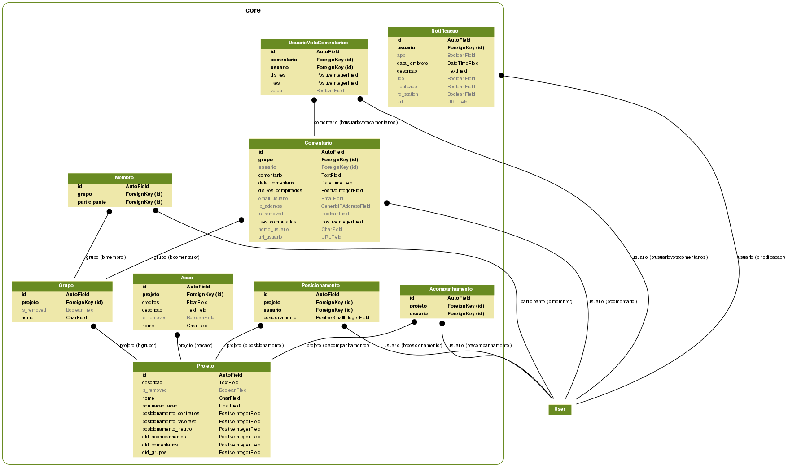

# Questões

Resposta das questões solicitadas

## Parlamentares

Todas as classes referente aos Parlamentares pode ser vista dentro do [ dirétorio](./senado/containers/).

## O desenvolvimento

O desenvolvimento da API foi feito baseado em um pacote python que poderá ser instalado via `pip install`. Foi feito desta maneira para ser reutilizável a qualquer programa que trabalhe com a linguagem;

Sendo assim para visualizar o pacote e testa-lo acess-se a [documentação](./README.md)

## Modelagem

A descrição dos atributos pode-ser vista dentro do arquivo de [Modelo Abstrato](./senado/abstract.py)

## Arquitetura

Ha duas maneira para arquitetar este sistema. A primeira é usar um sistema monolitp para validar a idéia e então conseguir adesão de usuários. A segunda, consiste em em uma API para todas as funcionalidades. Desde CRUDS básicos à necessidades complixades. Em conjunto com a segunda arquitetura escolhida para o backend, é necessário escolher um framework Javascript para exibir os dados para o usuário final. Para finalizar este tópico a arquitetura através de uma API pode ser consumida por diversos outros clientes como Android, IOS, Ionic, IOT, React Native, VueJs, Angular.

Para ambas as arquiteturas sistemicas deve ser adicionado ao registro e login de usuários o protocolo OAUTH2 com os principais provedores da internet (Google/Facebook)

Será utilizado também o soft delete, para que nenhum registro seja permanentemente excluido. Para isso será setado um atributo em todos as tabelas do tipo boleano.

Com isto temos:

### Recurso de Usuários

Administra todos as funcionalidades do usuários

- Um recurso para administração de CRUD de usuários

- Endpoint para registro de usuários

- Endpoint com autenticação JWT

- Endopoint para registro/login OAUTH2

- Endpoint para alterar senha

- Endpoint para enviar email para gerar uma nova senha

### Recurso de Projetos

Administrar todas as funcionalidades dos projetos de lei. É uma funcionalidade Core do sistema

- Um recurso para administração de CRUD de projetos

- Endpoint para setar um posicionamento. Dentre as opções (Contrário, Neutro, Favorável) vindos do cliente (Browser, Mobile...)

- Endpoint para listagem de projetos, paginados e que receba filtros.

De acordo com a modelagem feita eu consigo saber quais são os projetos mais populares e controversos, de acordo com a quantidade de grupos, quantidade de ações e o valor de cada crédito de sua ação, quantidade de comentários relevantes e quantidade de votos de acordo com o posicionamento usuário.

####  Recurso Acompanhamento

Gerir os usuários que irão acompanhar um Pojeto. Muito similar ao que é utilizado no Github, watchers, e que gera uma notificação via e-mail

- Um recurso para administração de CRUD de Acompanhamento

- Endpoint para inscrever o observador ao projeto

- Endpoint para cancelar a inscrição do observador naquele projeto

#### Recurso Grupos, Membros e Comentarios

É uma funcionalidade para criar grupos e gerir os membros participantes de um respectivo Projeto. Similar as redes sociais

##### Grupos

Cada grupo criado será computado na tabela de projetos.

- Um recurso para administração de CRUD de Grupos

Internamente quem cria um grupo é o resposável por ele.

- Endpoint para alterar nome do grupo (usuário)

- Endpoint para adicionar/inscrever membro (usuário)

- Endpoint para remover/sair membro (usuário)

##### Membros

- Um recurso para administração de CRUD de Membros

##### Comentários

Gerir os comentários postados pelos usuários em seus respectivo Grupo.

- Um recurso para administração de CRUD de Comentários

- Endpoint para criar um comentário em um grupo

- Endpoint para responder um comentário em um grupo (abrir uma thread comum em forums, youtube, slack)

- Endpoint para pontuar um comentario +1 ou -1.

Similar ao google plus ou facebook (like/dislike). Assim temos uma relevância nos comentários no grupo e que pode ser usado para pontuar um pojeto de lei

#### Ações

Representa um cadastro de uma ação referente a um projeto e sua respectiva pontuação para gerar dados estátisticos

Ou seja a cada adição de uma Ação ao Projeto internamente é gerado uma função para criar um registro na tabela de Notificação e enviar a notificação por e-mail.

Cada ação possui um peso ou crédito que será computado na tabela de projetos.

- Um recurso para administração de CRUD de ações

### Recurso de Notificação

Administrar as notificações para os usuários

- Um recurso para administração de CRUD de Notificações

- Endpoint para setar a Notificação como Lida

## Infraestrutura

Pensando nessa modelagem de dados e para atender o MVP desse sistema faria assim.

Lembrando que tudo depende do APORTE utilizado na implantação de um sistema. Abaixo segue algumas estratégias que podem ser adotadas ou não.

### Primeira estratégia

Colocaria 3 VPS da Digital Ocean. 01 para a aplicação API e outra separada na mesma rede para o Banco de Dados e por fim 01 para o cliente webrowser. Dessa maneira teria 3 VPS a 5 doláres cada.

Em seguida colocaria um varnish para cachear os dados das consultas feitas na API. Reformulária a maioria das queries para buscar os ID's, em django, utilizária o values_list('id', flat=True) no queryset. E depois faria um get em cada ID da lista buscando somente os dados essenciais para o cliente.

Pode-se usar também um Redis para salvar esses ID's de consultas e antes de fazer a consulta, values_list, verificaria se existe um chave/key correspondente a aquela consulta e retornaria os id's já cacheados.

#### Estáticos e medias.

Utilizaria um sistema como S3 ou CDN's para distribuir os estáticos das minhas aplicações client (browser). Retirando a responsabilidade do NGINX fazer isso.

#### Relatórios

Acredito que essa aplicação seja para gerar dados estásticos. Logo os relatórios eu não faria no sistema principal. Teria uma nova aplicação sendo assim mais uma VPS, 04 até o momento, para gerir a aplicação BACKEND como um todo.

Então adicionaria um sistema de filas RabbitMQ, por exemplo, e a cada chamada de um relatório eu produzo esse evento para a FILA passando os dados de quem solicitou. O CONSUMIDOR seria feito em GoLang. Nota: Golang é muito rápido e ideal para processamentos de dados.

Esse consumidor realiza a busca na base de dados e então processa os dados gerando um XML. Com o buffer de bytes eu entregaria o XML anexado ao email que será enviado pelo serviço da SENDGRID. A sendgrid possui uma cota de 12.000 email's gratuitos.

Também posso enviar esse XML para um S3 bucket e este so é visualizado para quem possui permissão. Essa listagem de arquivos deve ser exibida na tela onde o relatório será chamado. Assim o usuário poderá ver o relatórios gerados e realizar o download dele ao invés de baixar.

### Segunda estratégia.

Caso a infraestrutura e procedimentos acima não suporte ainda a quantidade de acessos e processamento. Iria avaliar o uso de escalonar um banco de dados na AWS. Este caso iria depender muito do preço e beneficio gerado.

Outra passo a ser adotado é a utilização de várias máquinas de backend com round robin do Nginx. O objetivo é de aliviar a carga de processamento de uma única VPS. Nesse modelo de escalonamento da aplicação é interessante o ESTUDO do Docker para facilitar esse processo.

### Terceira estratégia.

Adoção de outros serviços para substituir funcionalidades desenvolvidas. Por exemplo, a primeiro momento, utilizar o Google Firebase, através dos recursos: banco de dados (comentários e notificações) e sistema de notificação.

Verificar outros serviços para atender cada necessidade.

### Quarta estratégia.

Considerar utilizar outras linguagens de programação (NodeJs, Go  e etc...) e NOSQL para formar um sistema hibrido.

Alterar a estrutura criada e separando o sistema monolito em micro serviços. Este último deve ser muito bem estudado, para que o ecossistema funcione corretamente.

Diversas medidas devem ser adotatas para chegar nesta etapa:

- Reverter uma alteração ou funcionalidade na aplicação sem muitos esforços

- Utilização de testes de unidade, integração e entrega continua bem definida.

- Processo de escalonamento da aplicação bem consolidada.

- Logar todos os processos e erros do sistema. Inclusive de deploy
